Measuring leaf area with ImageJ
================
Roman M. Link

# Introduction

This is a simple tutorial for the measurement of leaf area with
[ImageJ](https://imagej.nih.gov/ij/) based on [this great blog
post](https://rookieecologist.wordpress.com/2016/11/21/how-to-measure-leaf-area-in-imagej/)
which is meant for in-class use.

# Important note

All ImageJ results tables can be saved either in ‘Comma Separated Value’
(`.csv`) or whitespace/tabstop separated format (generated when saving
with a `.xls` extension, but actually just a plain text format). In
either case, the output is optimized for US/UK locales, which means that
points are used as a decimal separator. In order to process these files
on German systems without compatibility issues, it is important to make
sure that the system-wide decimal separator is correctly set before
starting the analysis.

In German Windows 10, the option to change the decimal separator is well
hidden:

**Start Menu ➜ Windows-System ➜ Systemsteuerung ➜ Zeit und Region ➜
Region ➜ Formate ➜ Weitere Einstellungen ➜ Dezimaltrennzeichen**

To avoid data compatibility problems, make sure the decimal separator is
set to “.”. In this case, you will want the grouping symbol (**Symbol
für Zifferngruppierung**) to be a comma instead of the point symbol
used in Germany.

If you do not want to change your system settings, you can alternatively
export everything in a `.csv` format and use Excel’s **Daten ➜ Text in
Spalten** menu to manually set field delimitor and decimal separator.

In addition, before you start with the analysis, make sure that the
options for analyzing threshold images are correctly set. Go to
**Process ➜ Binary ➜ Options** and make sure that the box **Black
background** is not marked to avoid problems with the particle analysis
macro.

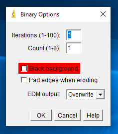

# Step-by-step tutorial

1.  Open the calibration file with ImageJ (drag and drop onto the
    program or use the Open dialogue).

2.  Select the Straight line tool and follow the outer margin of the
    largest square in the calibration file.

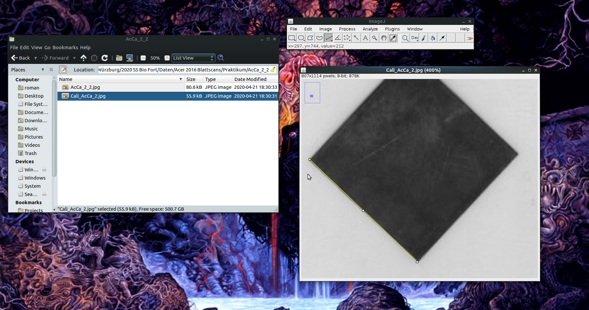

3.  Set the scale by going to the **Analyze ➜ Set Scale** menu.

4.  In the corresponding dialogue, set **Known Distance** to **4 cm**,
    the **Unit of length** to **cm** and - *very important* - mark the
    box **Global** to make sure that the scale is the same accross all
    opened documents.

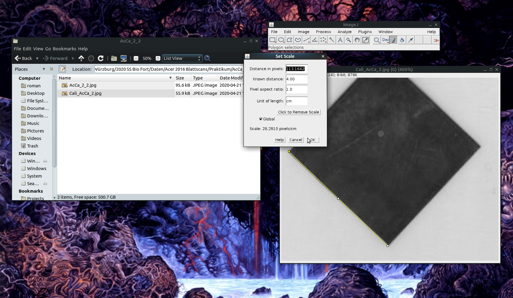

5.  Open the file with the image you want to analyze in ImageJ (drag and
    drop\!). If setting the scale worked, the size of the image should
    now be specified in cm in the upper right corner of the image. If a
    popup opens asking you whether you want to keep the global
    calibration, say yes\!

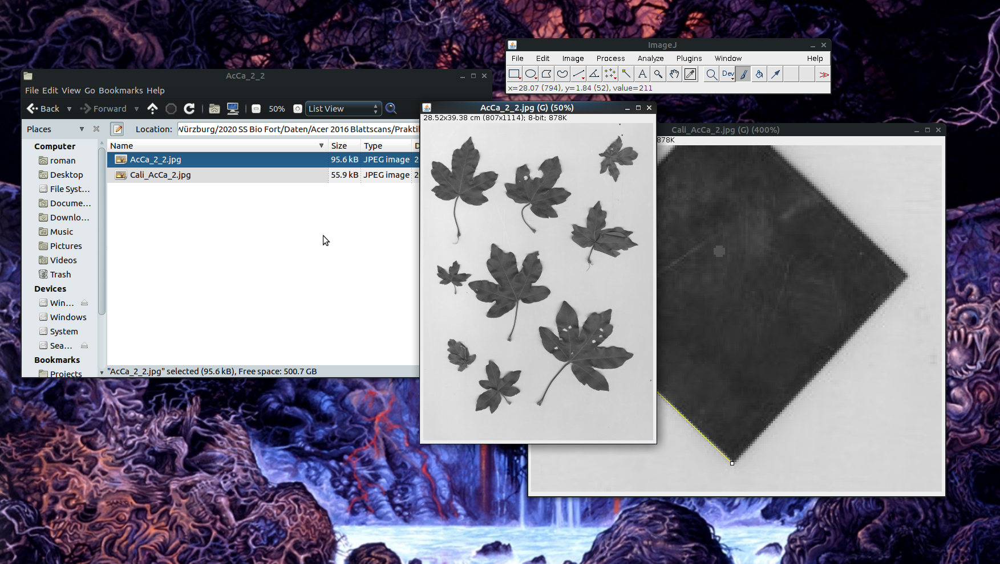

6.  Make sure that the image is in an 8bit black and white format (click
    on **Image ➜ Type ➜ 8bit**) to avoid problems with thresholding.

7.  Set a black/white threshold
    
      - Open the **Threshold** dialogue (**Image ➜ Threshold** or *Ctrl
        + Shift + T*),
      - Choose the options **Default** and **B\&W** and uncheck the box
        **Dark background**,
      - If necessary, move the sliders until the leafs are well
        separated from the background with as few white pixels within
        the leaves as possible,
      - press **Apply** and close the **Threshold** window.

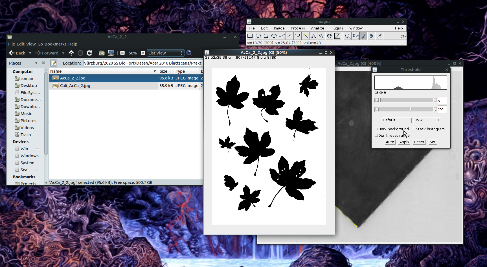

8.  If there are holes (especially close to the leaf margins), pick the
    *Pipette* tool and click on a black area in the image.

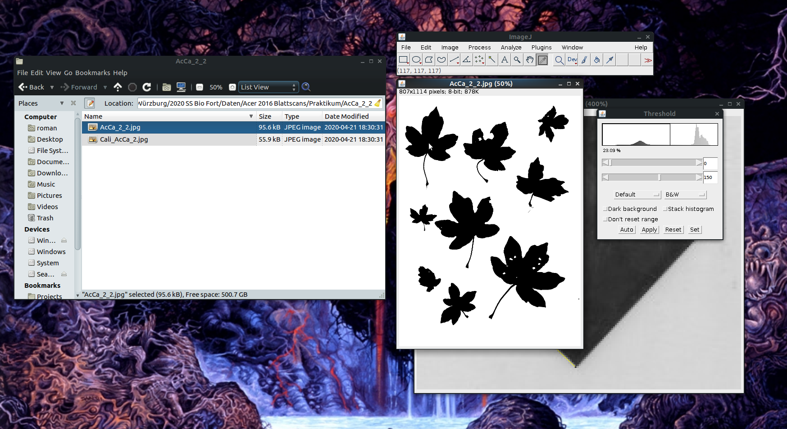

9.  Now, choose the *Pencil tool* and close the holes manually.

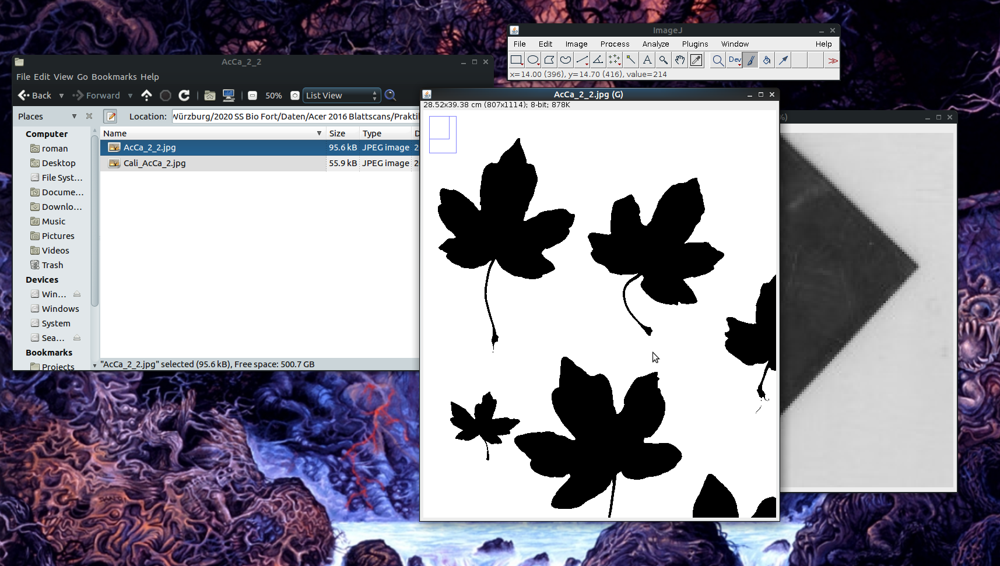

10. Open the set measurements dialogue (*Analyze ➜ Set Measurements*),
    uncheck everything besides *Area*, and click *OK*.

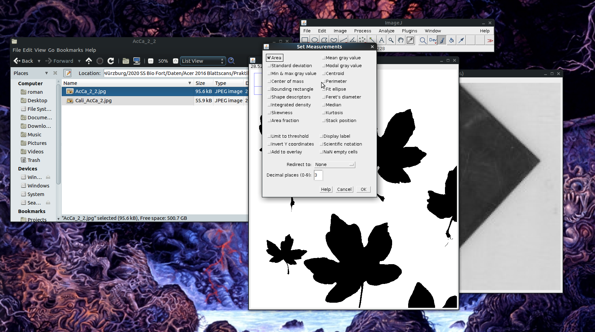

11. Open the *Analyze Particles* dialogue (*Analyze ➜ Analyze
    Particles*) and choose the following settings:

<!-- end list -->

  - *Size*: 0-Infinity
  - *Roundness*: 0-1
  - Show: Outlines
  - Check *Display results*, *Clear results* and *Include holes*

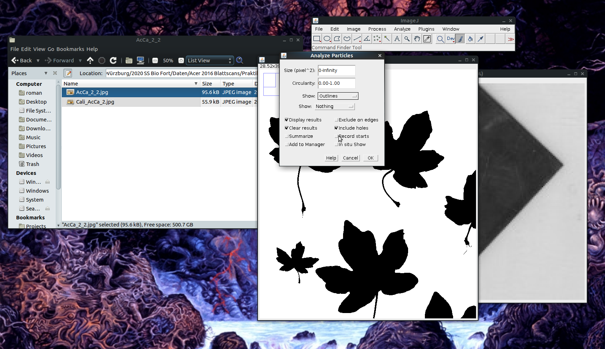

12. Look at the outlines to check if non-leaf particles were measured.

<!-- end list -->

  - Solutions if there are small non-leaf particles:
      - Use the pencil tool to remove small artefacts
      - Use the rectangle tool (left end of the toolbar) to choose a
        subset of the Image area (useful if there are shading artefacts
        near the borders)
      - Repeat the *Analyze Particles* step with a minimum value for
        *Size*

*initial run:* 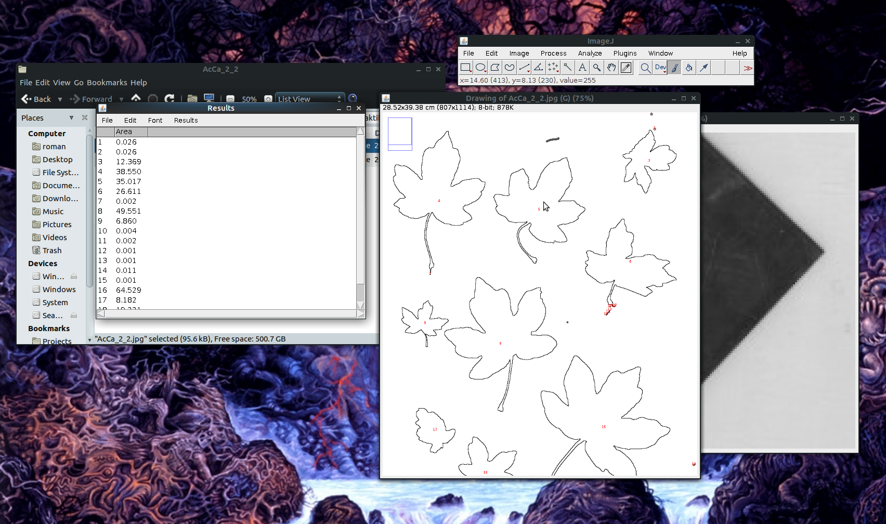

*after setting Size to 1-Infinity cm²:* 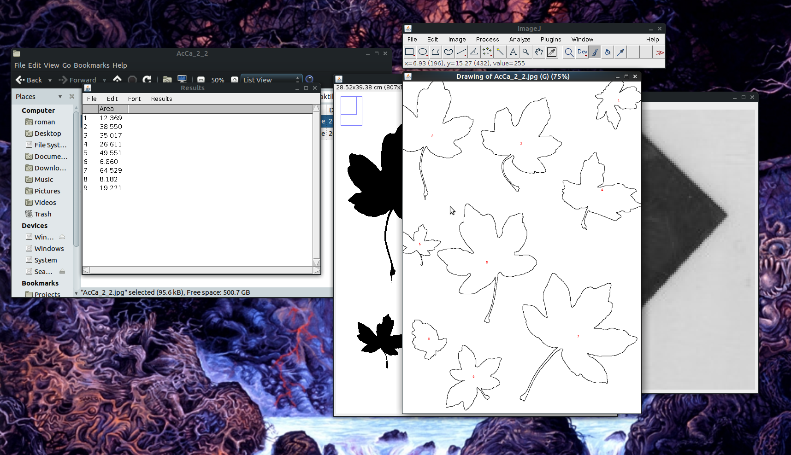

13. Click on the outline file and choose *File ➜ Save as ➜ Jpeg* in the
    main window to save it (append the original filename to
    `name_outlines.jpg`)

14. Choose *File ➜ Save as* in the Results window to save the leaf area
    measurements as `name_results.xls`.

15. Your project folder should look like this now:

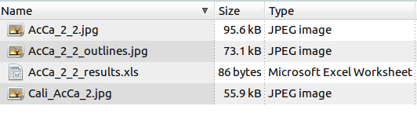
