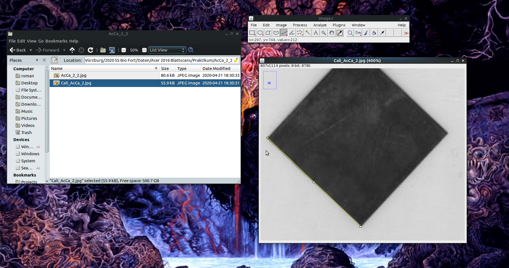
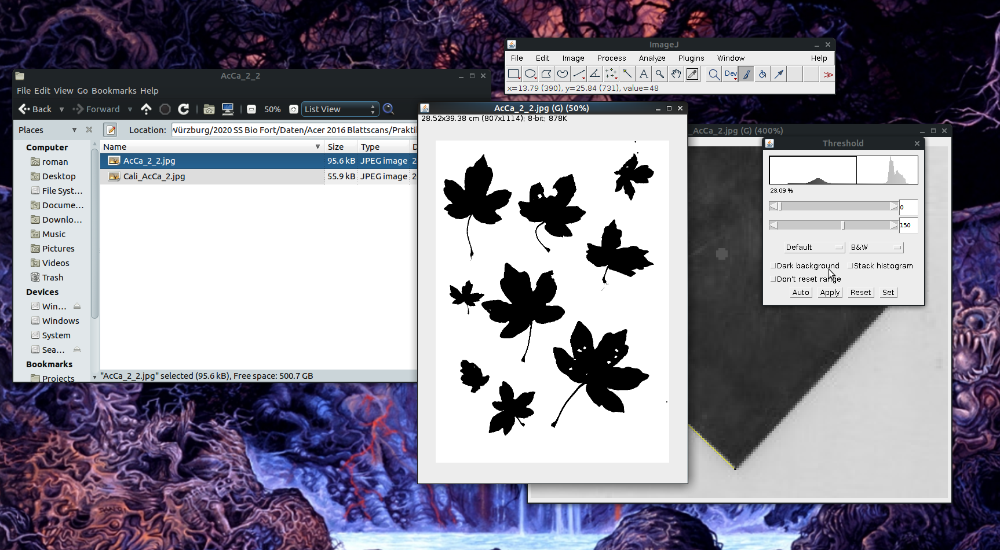
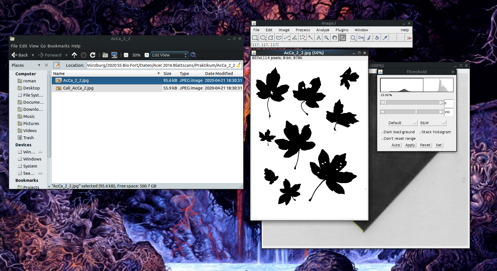
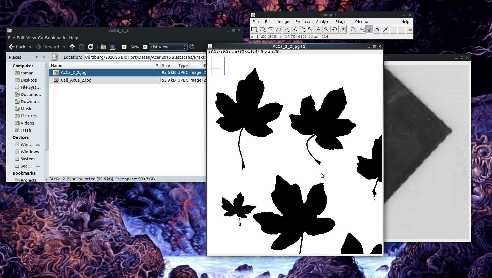
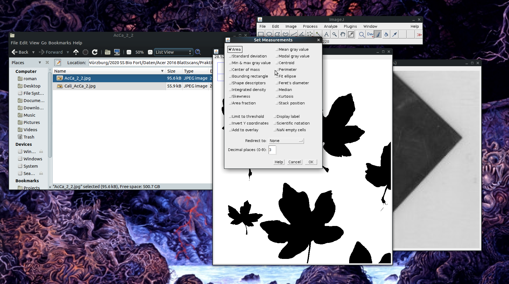
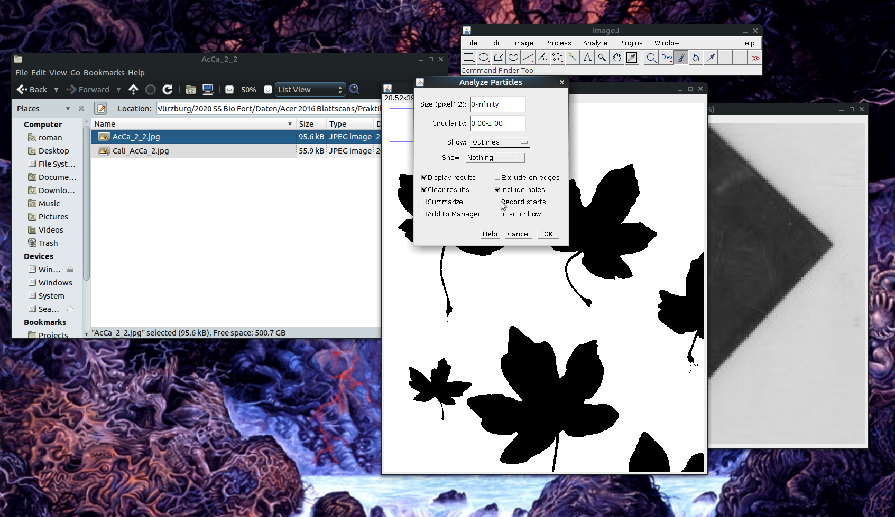

# Introduction {-} 
This is a simple tutorial for the measurement of leaf area with [ImageJ](https://imagej.net) (or most likely [Fiji](https://imagej.net/Fiji), its powerful little brother) based on [this great blog post](https://rookieecologist.wordpress.com/2016/11/21/how-to-measure-leaf-area-in-imagej/) which is meant for in-class use.

# Important note {-}
All ImageJ results tables can be saved either in 'Comma Separated Value' (`.csv`) or whitespace/tabstop separated format (generated when saving with a `.xls` extension, but actually just a plain text format). In either case, the output is optimized for US/UK locales, which means that points are used as a decimal separator. In order to process these files on German systems without compatibility issues, it is important to make sure that the system-wide decimal separator is correctly set before starting the analysis.

In German Windows 10, the option to change the decimal separator is well hidden:

__Start Menu ➜ Windows-System ➜ Systemsteuerung ➜ Zeit und Region ➜  Region ➜ Formate ➜ Weitere Einstellungen ➜ Dezimaltrennzeichen__  

To avoid data compatibility problems, make sure the decimal separator is set to ".". In this case, you will want the grouping symbol (__Symbol für Zifferngruppierung__) to be a comma instead of the point symbol used in Germany.

If you do not want to change your system settings, you can alternatively export everything in a `.csv` format and use Excel's __Daten ➜ Text in Spalten__ menu to manually set field delimitor and decimal separator.

In addition, before you start with the analysis, make sure that the options for analyzing threshold images are correctly set. Go to __Process ➜ Binary ➜ Options__ and make sure that the box __Black background__ is not marked to avoid problems with the particle analysis macro.

# Step-by-step tutorial

1. Open the calibration file with ImageJ (drag and drop onto the program or use the Open dialogue). The calibration file should contain a size reference with a known length. In this example, the calibration file (prepared for the analysis with a different software) contained three paper squares of known area and side length, but in theory any reference of known dimensions will suffice (e.g. a ruler or millimeter paper). 

2. To calibrate, Select the Straight line tool and trace the size reference (in the given example, I followed the outer margin of the largest square in the calibration file, which I knew to be 4 x 4 cm²).

    

3. Set the scale by going to the __Analyze ➜ Set Scale__ menu.

4. In the corresponding dialogue, set **Known Distance** to the known reference value (in this case, **4 cm**), the **Unit of length** to **cm** and - *very important* - mark the box **Global** to make sure that the scale is the same across all opened documents.

    

5. Open the file with the image you want to analyze in ImageJ (drag and drop!). If setting the scale worked, the size of the image should now be specified in cm in the upper right corner of the image. If a popup window opens asking you whether you want to keep the global calibration, say yes!

    

6. Make sure that the image is in an 8bit black and white format (click on __Image ➜ Type ➜ 8bit__) to avoid problems with thresholding. 

7. Set a black/white threshold
    * Open the __Threshold__ dialogue (__Image  ➜  Threshold__ or _Ctrl + Shift + T_),
    * Choose the options __Default__ and __B&W__ and uncheck the box __Dark background__,
    * If necessary, move the sliders until the leafs are well separated from the background with as few white pixels within the leaves as possible,
    * press __Apply__ and close the __Threshold__ window.

    

8. If there are holes in the leaves that connect with the leaf margins, pick the _Pipette_ tool and click on a black area in the image. Holes that are in the middle of the leaf do not have to be fixed as they will not affect the measurement if the "Include holes" option is selected (see below).

    

9. Now, choose the _Pencil tool_ and close the holes manually (I closed all, but that's not necessary).

    

10. Open the set measurements dialogue (_Analyze ➜ Set Measurements_), uncheck everything besides _Area_, and click _OK_.

    

11. Open the _Analyze Particles_ dialogue (_Analyze ➜ Analyze Particles_) and choose the following settings:
  * _Size_: 0-Infinity [0 is chosen to demonstrate the effect of a small minimum value (see next points) - in most cases it makes sense to start from 1-Infinity right away]
  * _Roundness_: 0-1 
  * Show: Outlines
  * Check _Display results_, _Clear results_ and _Include holes_ (if there is more than one scan per sample, it can also be a good idea _not_ to choose _Clear results_ to be able to combine the measurements of all scans and save all results together in a single file)

    

12. Look at the outlines to check if non-leaf particles were measured.
  * Solutions if there are small non-leaf particles:
    * Use the pencil tool to remove small artefacts
    * Use the rectangle tool (left end of the toolbar) to choose a subset of the Image area (useful if there are shading artefacts near the borders)
    * Repeat the _Analyze Particles_ step with a different minimum value for _Size_

_initial run:_
    

_after setting Size to 1-Infinity cm²:_
    

13. Click on the outline file and choose _File ➜ Save as ➜ Jpeg_ in the main window to save it (append the original filename to `name_outlines.jpg`)

14. Choose  _File ➜ Save as_ in the Results window to save the leaf area measurements as `name_results.xls`.

15. Your project folder should look like this now:

    

